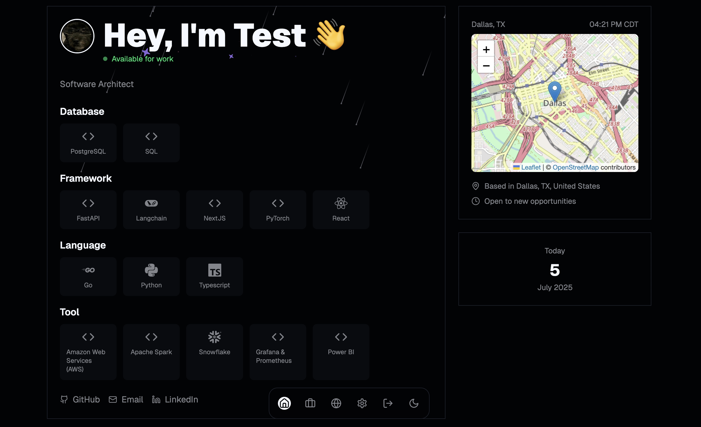
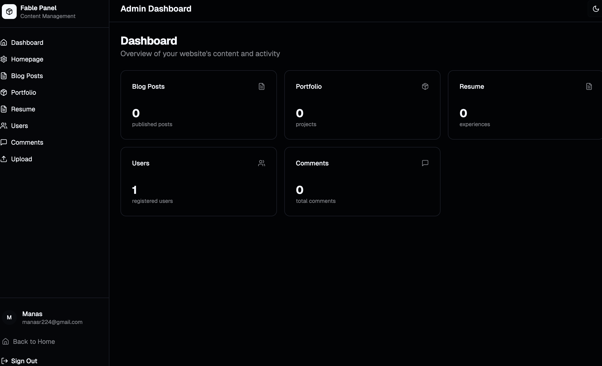
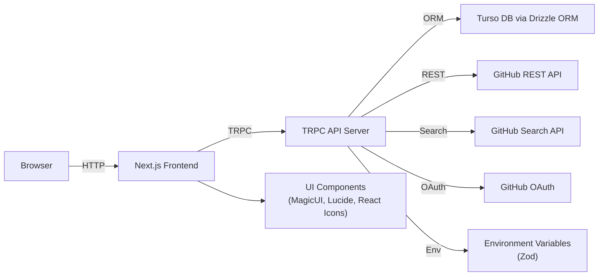

# Fable

## Project Overview
Fable is a modern personal website that includes a resume, portfolio, blog, and custom admin CMS, built with Next.js, TRPC, and Drizzle ORM on Turso.

## Screenshots

*Homepage of the Fable website showcasing the modern design and layout.*


*Custom admin CMS for managing website content efficiently.*

## Features
- Dynamic resume with timeline
- Portfolio showcase with starred projects
- Blogging platform with markdown support
- Admin CMS for managing content
- Live GitHub statistics (repos, stars, forks, commits, PRs)
- Interactive map and real-time clock
- Dino game Easter egg

## Tech Stack
- Next.js (App Router, React)
- TRPC for type-safe APIs
- Drizzle ORM with Turso database
- Tailwind CSS & Radix UI for styling
- React Icons & Lucide for iconography
- GitHub REST API & Search API integrations
- Zod for environment validation
- PNPM & TypeScript

## Architecture


## Getting Started

### Prerequisites
- Node.js 18+
- PNPM
- Turso DB (configured via `TURSO_DATABASE_URL`)

### Installation
```bash
git clone https://github.com/USERNAME/fable.git
cd fable
pnpm install
```

### Environment Variables
Create a `.env` file in the project root with the following:
```
GITHUB_CLIENT_ID=your_client_id
GITHUB_CLIENT_SECRET=your_client_secret
GITHUB_USER_NAME=your_github_username
GITHUB_USER_EMAIL=your_email
BETTER_AUTH_SECRET=your_auth_secret
TURSO_DATABASE_URL=your_turso_url
TURSO_AUTH_TOKEN=your_turso_auth_token
NEXT_PUBLIC_GEOCODE_MAPS_CO_API_KEY=your_maps_api_key
```

### Running
```bash
pnpm dev
```
Open http://localhost:3000 in your browser.

## Contributing
Contributions are welcome! Please open an issue or submit a PR with your changes.

## License
This project is licensed under the MIT License.